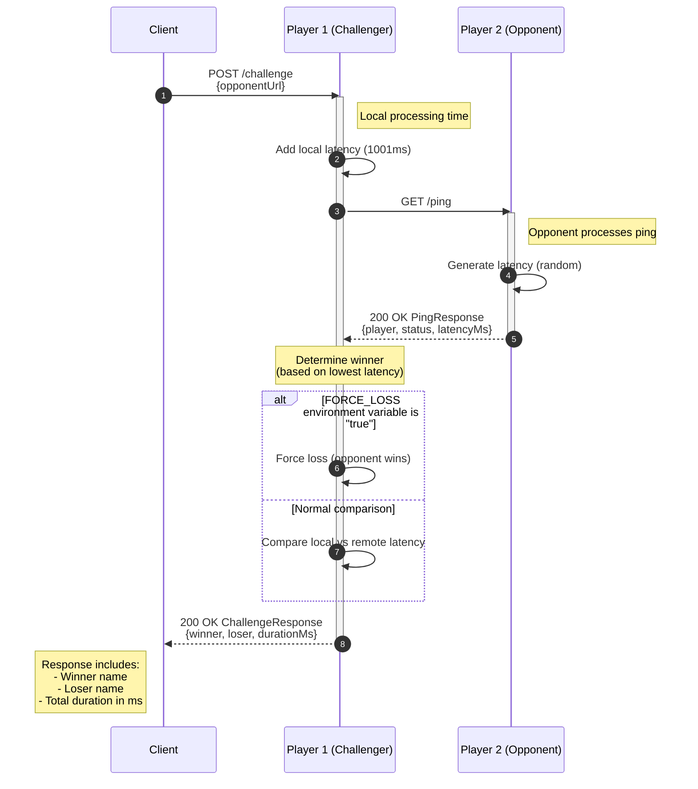

# Player Service Challenge Flow



## Challenge Request Format

```json
{
  "opponentUrl": "http://opponent-service/ping"
}
```

## Challenge Response Format

```json
{
  "winner": "winnerPlayerName",
  "loser": "loserPlayerName",
  "durationMs": 2500
}
```

## Implementation Details

The challenge endpoint:
- Accepts a POST request with the opponent's ping URL
- Applies a fixed local latency of 1001ms to the challenger
- Makes a GET request to the opponent's ping endpoint
- Measures the opponent's response time
- Determines the winner based on the player with the lowest latency
- Can be configured to always lose by setting the `FORCE_LOSS` environment variable to "true"
- Returns the winner, loser, and total duration of the challenge

This is used in the tournament to determine which player responds faster.
