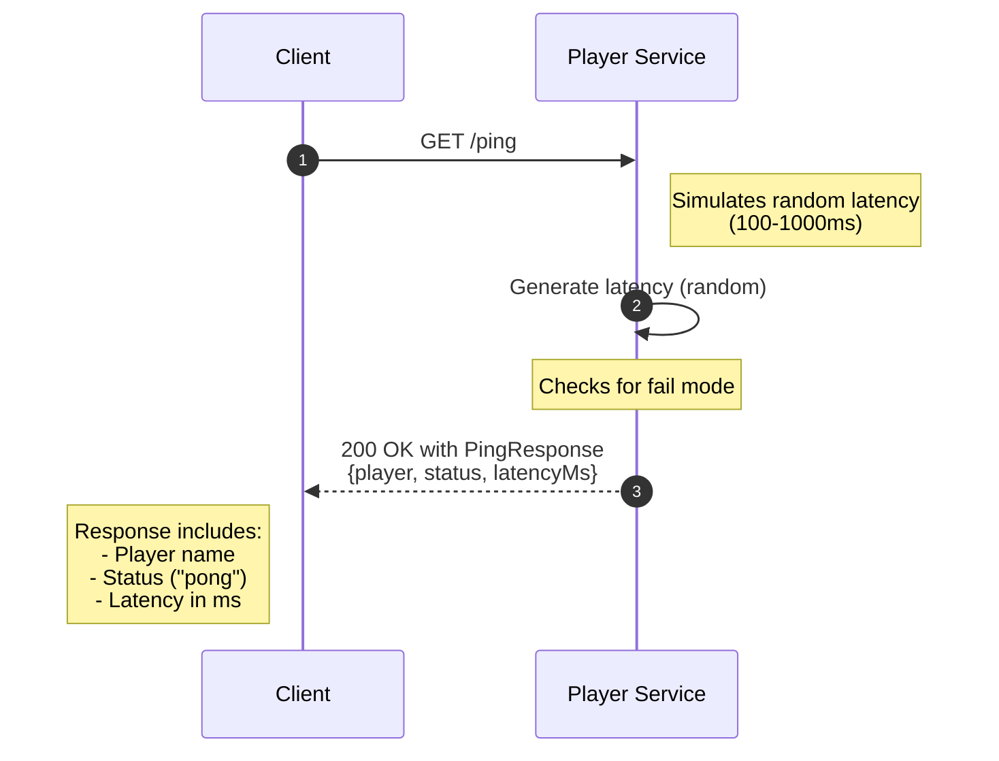

# Player Service Ping Flow



## Ping Response Format

```json
{
  "player": "playerName",
  "status": "pong",
  "latencyMs": 123
}
```

## Implementation Details

The ping endpoint:
- Simulates a random latency between 100-1000ms
- Can be configured to return error codes for testing using the `FAIL_MODE` environment variable
- Returns the player name, status, and latency information
- Used by the challenge endpoint to test responsiveness of other players
